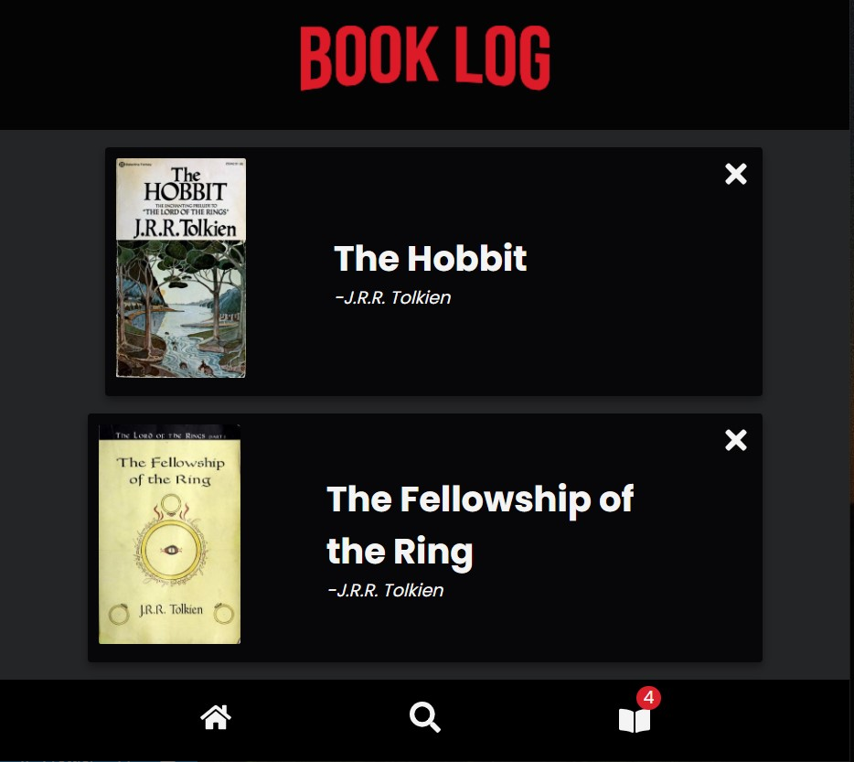

# Book Log
A Netflix styled application that fetches data from Open Library API to use in keeping track of a reading list.



## Todos
- Integrate search bar into header?
- Add randomizer function
- Add book info popups and links to full text
- Reimplement pagination
- Implement redux for state management

## Run
Clone the repository, then...

```bash
# Install dependencies
$ npm install

# Set up a local storage key variable
e.g, REACT_APP_MY_KEY = keys.key


# Start up the application
$ npm start
```

## Use
Search for a book from the library and find the book you would like to add to list, click the '+' button to add to your list